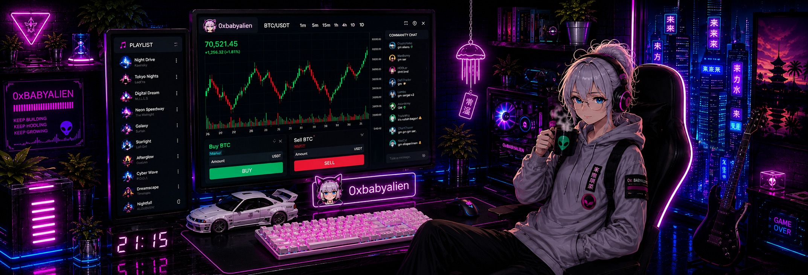

<head>
    <link rel="stylesheet" type="text/css" href="css/style.css">
    <link rel="stylesheet" type="text/css" href="css/death.css">
</head>

 

<h2>👩‍🚀 Social</h2> 

 
 

</a>

 
 
<h2>☕ Coffee</h2>
 

 

 

<h2>📊 Stats</h2>  
<picture>
  <source media="(prefers-color-scheme: dark)" srcset="x/github-user-contribution.svg" />
  <source media="(prefers-color-scheme: light)" srcset="x/github-user-contribution.svg" />
  
</picture>

  

 

 

